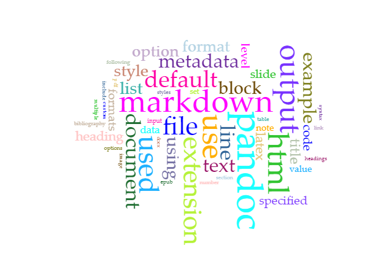
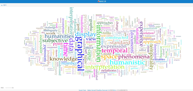
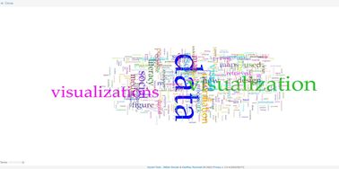
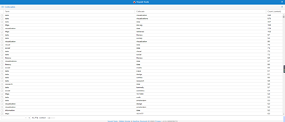
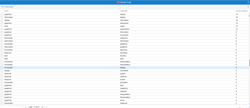
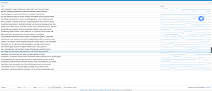
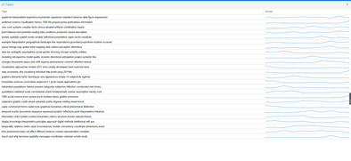
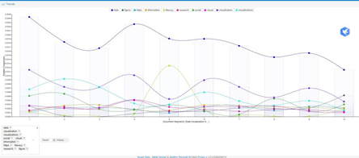
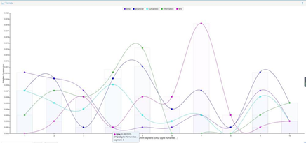
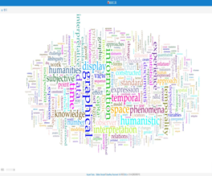

# Abustract

Abstract:
Purpose: This research aims to introduce readers to Voyant tool, a text analysis tool. which the written word can be understood in new ways through using it.
Design/methodology/approach: Here, two data sets will be analyzed using Voyant tools, and essential information will be gleaned from them through observation and data content. These tools are the correlation tool, the Cirrus tool, the Topics tool, and the Scatter Plot tool. All four tools tested on the data are salable and tuned in their settings to demonstrate that input conditions affect the modeling of textual data.
Value: Since there is not much early literature on how quantitative data can help readers read more efficiently, visualization types like Voyant tools are all more valuable for research.

# Introduction

This is my introduction.

Voyant Tools is a free open source text analysis package available on the Web that provides the ability to parse complex texts, especially for scholars in the digital humanities and students and the general public. (Sampsel, Laurie J. "Voyant Tools." Music reference services quarterly 21.3 (2018): 153-157. Web.) Humanity is a profession that needs to be built on reading texts and developing explorations.

On the other hand, digital humanity is a discipline dedicated to the interplay of digital tools and the humanities, different from other liberal arts categories. It eschews traditional means of learning and relies on technology to explore more valuable data. Voyant tools, as a reading tool, transform complex texts into small units of meaning, providing the ability to read texts differently. Although it is not common in all disciplines, on the one hand, reducing the text will make it lose some of its information, but it can still be used as a means to read quickly. The veracity of this result depends on the design of the study and the sampling technique.

Voyant "aims to enhance reading through lightweight text analysis, such as word frequency lists, frequency distribution maps, and KWIC displays." (Klein, Lauren F.; Eisenstein, Jacob; Sun, Iris (2015). "Exploratory Thematic Analysis for Digitized Archival Collections." Digital Scholarship in the Humanities. 30 (Supp. 1): i138. doi:10.1093/LLC/fqv052) expresses to the public that digital tools will provide easier access for textual research based on the concept developed by Voyant Tools. This will be tested by using the functions that come with Voyant Tools. Voyant Tools also contributes to the development of the humanities in quantitative data visualization research.

# Methodology

As this is an exploratory study, a convenience sample will be used here. Two scholarly English articles were put into Voyant Tools. Based on the number of searches and the words as a basis for reading, the inverse inference of the articles is performed, thus confirming the usefulness and value of the tool. Respondents will be asked to use the tools in Voyant Tools and read the simplified articles, which will be analyzed to derive the general content of the articles, which the experiment sponsor will provide.
1. Data Visualization in Society
2. Antisemitism on social media
Since the reader has not read the article in advance, the final result should only be consistent with the article's main content. Therefore, this experiment will be analyzed through the four refresher courses provided by Voyant Tools.

Cirrus tool

This word cloud creation tool places the most frequently occurring words in the article in the middle and displays them at the largest font size, with nearby words following similarly. The maximum number of words can be obtained from a specified corpus.

Collocates tool

The corpus collocates is a table view with the keywords being searched for on the left (optional) and the most frequent words appearing near the keywords in the whole corpus on the right. This way, it is easy to link words together to get a general idea of the article.

Topics tool

The topics tool provides a fundamental way to generate term clusters from a document or corpus and then see how each topic is distributed across the document or corpus. Topic modeling uses a technique called latent Dirichlet assignment. It divides sentences into different topics and forms different models. Clusters and distributions can be found with the help of the Topic Tool.

Trends

Trends show a line graph depicting the distribution of occurrences of a word in a corpus or document. Trends are a visualization that indicates the frequency of terms between passages. Each series in the chart is colored according to the word it represents, and the legend at the top of the chart shows which words are associated with which colors.

# Result

In Figure 1, it can be seen that "data" is the most frequent word because it is in the center of the word cloud. However, it is impossible to define the whole article by this one word. However, with the help of auxiliary words that appear near the central word, such as "Visualization," we can further infer and roughly determine which aspect of data the article used for the experiment refers to. List of words containing the most typical non-content words, such as "the, and, or but. The rest of the words have attributes that are mostly nouns, which are complementary to other text-specific words, such as however, some, most, etc. The core idea of "social use of data visualization" was derived from the image analysis. The words "graph," "chart," and "map" also appear several times in the sentences. These words can be used to explain, persuade, and tell the content of this paper. The reader can study the dissemination of these visualizations and their impact on society through personal conjecture and concerning the actual phenomena in society, the speed with which digital tools enable the production of visualizations. The data analysis must be guided by the actual social context and the scientific analysis of the data to arrive at a relatively correct understanding.

As you can see in Figure 2, "graphical" is the most frequent word in the center of the graph, but in fact, you can see that there are several words nearby that are about the same size. This proves that they appear almost simultaneously many times in a passage. This reduces the time spent on reasoning, even though the reader has not read the article beforehand. This experiment introduces quantitative analysis of qualitative experience into our dataset and makes further inferences. This is a meaningful act of research for the humanities and will emerge as more possibilities emerge with the advent of technology.

# Analysis

Why choose Voyant tools? JJewell and Zillig write that, arguably, “most text analysis tools are not designed for average humanities scholars” and, typically, when these scholars use digital humanities tools, “t Fortunately, these complaints about ease of use are generally unfounded with Voyant Tools. The greatest feature of Voyant Tools is its user-friendliness, which is achieved through its extensive documentation, simple user interface and data export Capability. 

Voyant Tools Documentation Site
[^fn1] from http://docs.voyant-tools.org/ Contains a multimedia explanation of this resource for those seeking more information. Containing text, screenshots, and screencast tutorials (all less than four minutes long), the documentation site makes configuring and using Voyant tools the basics and more simple for advanced users. Among the many features of Voyant Tools, the most attractive is the clean interface. This quality is reflected in the individual data entry fields on the home page as well as in the dashboards of the data analysis panels. Each panel contains a different tool for text analysis (eg Cirrus, a word cloud generator) and can be configured according to user preferences.

# Discussion

"My argument is a polemical call to humanists to think differently about the graphical expressions in use in digital environments." (Johanna Drucker). He advises us not to be biased against new frameworks for constructing data. We should not have an overly pessimistic view when dealing with technology development. The essence of supporting data is quantitative analysis, do not distort its existence and meaning from the beginning. In other words, all data is "Capta," as defined in Johanna Drucker's article, is "taken" actively while data is assumed to be a "given" able to be recorded and observed. 

Voyant tool is an open-source text mining option that is user-friendly and well documented. Voyant has transformed and succeeded as a valuable and valuable complementary technology in the trans formative technological upgrade. This experiment demonstrates the possibilities that Voyant tools can offer. Voyant Tools offers an impressive range of techniques to enable text or data to be presented through quantitative forms. However, the visualization tools introduce people's assumptions into the data, which does not fully present the text's actual meaning, so one needs to be careful with its use.

The data obtained using Voyant tools should always be contrasted with the actual data. However, there is no dispute that the use of Voyant tools provides considerable usefulness to the development of the humanities and that the study of visualization tools is a neighborhood worthy of further expansion.

# works cited

Hetenyi, Gabor, et al. “Quantitative Analysis of Qualitative Data: Using Voyant Tools to Investigate the Sales-Marketing Interface.” Journal of Industrial Engineering and Management, vol. 12, no. 3, 2019, p. 393., https://doi.org/10.3926/jiem.2929.

Sampsel, Laurie J. "Voyant Tools." Music reference services quarterly 21.3 (2018): 153-157. Web.

Klein, Lauren F.; Eisenstein, Jacob; Sun, Iris (2015). "Exploratory Thematic Analysis for Digitized Archival Collections". Digital Scholarship in the Humanities. 30 (Supp. 1): i138. doi:10.1093/LLC/fqv052

 “Humanities Approaches to Graphical Display by Johanna Drucker.” Scribd, Scribd, https://www.scribd.com/document/380756111/Humanities-Approaches-to-Graphical-Display-by-Johanna-Drucker.

 Steven E. Jones, The Emergence of the Digital Humanities (New York: Routledge, 2014), 60.

 Andrew Jewell and Brian L. Pytlik Zillig,
“’Counted Out at Last’: Text Analysis on the
Willa Cather Archive,” in The American Literature
Scholar in the Digital Age, ed. Amy E. Earhart and
Andrew Jewell (Ann Arbor: University of Michigan Press and University of Michigan Library,
2011), 172.

# notes
[^fn1]: see https://wikipedia.org.

[^fn1]: see https://Voyant-Tools.org.

